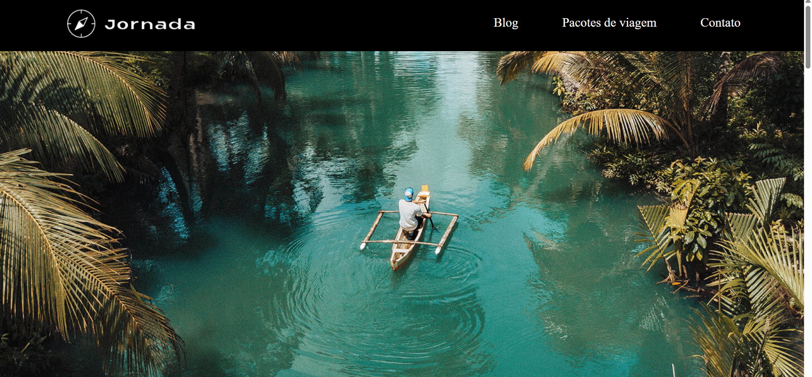

# ✈️ Travel Agency Landing Page

A mobile-first website developed during the HTML and CSS module of a React course at Alura/SP-Brasil.

## ✨ Features

- Mobile-first
- Progressive Enhancement
- CSS Grid and Flexbox
- Products gallery
- Semantic HTML
- Accessible navigation
- Reusable CSS architecture
- Unicode
- Gloogle Loghthouse

## 🛠 Technologies

- HTML5
- CSS3
- CSS Grid
- Flexbox
- Responsive Design
- Git
- GitHub Pages
- SEO 

## 🚀 Live Demo

https://danielgranato.github.io/mobile-first/

## 📚 What I learned

- Mobile-first responsive design.
- CSS architecture and reusable component patterns.
- CSS inheritance and style refactoring.
- Modular CSS organization with reusable utility and component classes.
- Responsive image optimization for mobile, tablet, and desktop.
- Cross-device layout debugging and bug fixing.
- Front-end performance optimization.
- SEO and accessibility improvements using Google Lighthouse.
- Writing cleaner, more maintainable, and scalable CSS.

## 👨‍💻 Author

Daniel Granato

GitHub:
https://github.com/DanielGranato

